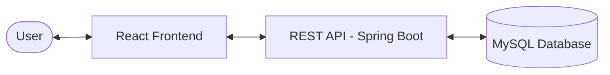
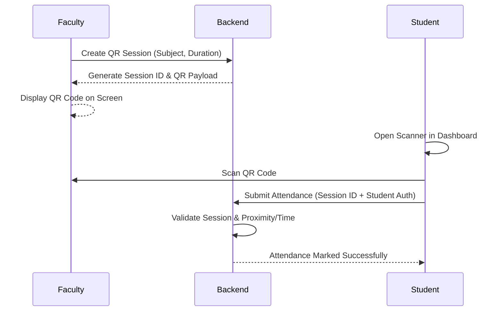

# CDAC Management Portal - Project Documentation

## 1. Project Overview
The CDAC Management Portal is a comprehensive full-stack application designed to streamline academic and administrative tasks within an educational institution. It provides role-based access for Students, Faculty, and Administrators to manage attendance, leave requests, and academic schedules.

---

## 2. Technology Stack

### Backend
- **Framework:** Spring Boot (Java)
- **Security:** Spring Security with JWT (JSON Web Token)
- **Database:** MySQL
- **ORM:** Spring Data JPA
- **Build Tool:** Maven

### Frontend
- **Framework:** React.js (Vite)
- **Styling:** Vanilla CSS / Tailwind CSS
- **Routing:** React Router DOM
- **Icons:** React Icons (Lucide/etc.)
- **API Client:** Axios

---

## 3. System Architecture

The project follows a decoupled Client-Server architecture.

### Communication Flow

---

## 4. User Roles and Features

### 4.1 Administrator (`ROLE_ADMIN`)
- **User Management:** Create, Update, Delete students and faculty.
- **System Monitoring:** Overview of portal activity.
- **Resource Management:** Manage subjects and general configurations.

### 4.2 Faculty (`ROLE_FACULTY`)
- **QR Generation:** Generate dynamic QR codes for attendance marking.
- **Attendance Management:** View and manage student attendance records.
- **Class Management:** Manage subjects assigned to them.
- **Leave Requests:** Review and approve/reject student leave requests.

### 4.3 Student (`ROLE_STUDENT`)
- **QR Attendance:** Scan QR codes generated by faculty to mark attendance.
- **Leave Requests:** Apply for leave and track request status.
- **Attendance Tracking:** View personal attendance percentage and history.
- **Dashboard:** Overview of upcoming sessions or messages.

---

## 5. Core Process Flows

### 5.1 Authentication Flow
1. User enters credentials on the Login page.
2. Frontend sends POST request to `/api/auth/signin`.
3. Backend validates credentials and returns a JWT token.
4. Token is stored in local storage/context for subsequent requests.
5. Navigation is handled role-wise (Admin -> `/admin`, Faculty -> `/faculty`, Student -> `/student`).

### 5.2 QR Attendance Flow

### 5.3 Leave Request Flow
1. Student submits leave application (Date, Reason).
2. Backend stores as `PENDING`.
3. Faculty/Admin views pending requests.
4. Action taken (Approve/Reject).
5. Student dashboard updates with the new status.

---

## 6. Database Schema Overview
- **User:** Stores core credentials and role.
- **StudentDetails / FacultyDetails:** Extended profiles linked to User.
- **Attendance:** Records session-wise attendance.
- **LeaveRequest:** Tracks leave applications.
- **QrSession:** Stores temporary session data for attendance scanning.
- **Subject:** Academic subjects list.

---

## 7. API Endpoints (Highlights)

| Method | Endpoint | Description | Access |
| :--- | :--- | :--- | :--- |
| POST | `/api/auth/signin` | Login & get JWT | Public |
| GET | `/api/admin/users` | List all users | Admin |
| POST | `/api/faculty/qr/generate` | Start attendance session | Faculty |
| POST | `/api/student/attendance/scan` | Mark attendance | Student |
| GET | `/api/student/leaves` | Get leave history | Student |

---

## 8. Exporting to PDF

To convert this documentation to a high-quality PDF:

### Option A: VS Code Extension (Recommended)
1. Install the extension **"Markdown PDF"** (by yyzhang).
2. Right-click anywhere in this file.
3. Select **"Markdown PDF: Export (pdf)"**.

### Option B: Online Converter
1. Copy the content of this file.
2. Paste it into [Dillinger.io](https://dillinger.io/) or [StackEdit](https://stackedit.io/).
3. Use the **Export as PDF** feature in their menu.

### Option C: Browser Print
1. Open this file in a Markdown viewer or GitHub.
2. Press `Ctrl + P` (Print).
3. Choose **"Save as PDF"** as the destination.
